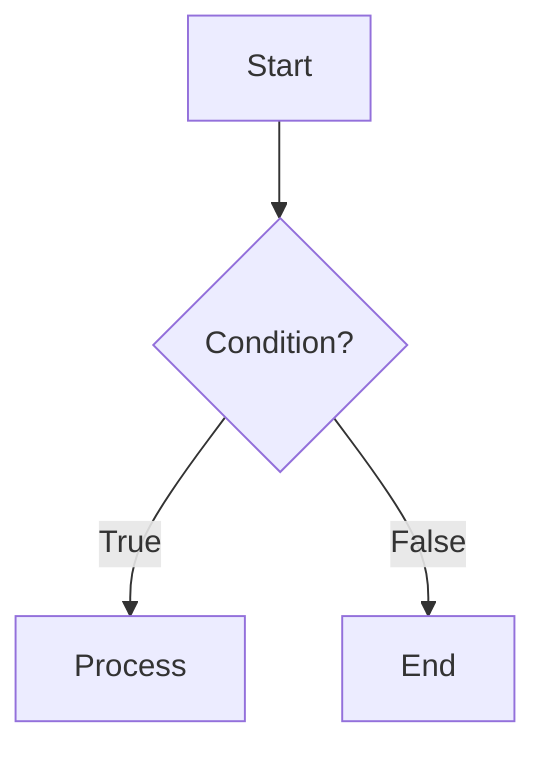

# 📚 Supported Markdown Syntax — `md-preview`

This document summarizes **all Markdown syntax supported by the [md-preview](https://github.com/ScorpioNov2/md-preview) tool**, compiled by directly reading the project's source code—primarily how `index.html` initializes and configures the `markdown-it` engine, along with all plugins in the [`js/`](https://github.com/ScorpioNov2/md-preview/tree/main/js) directory—rather than relying solely on the original README (which only provides a brief overview).

**Core Engine:** [`markdown-it@14.3.0`](https://github.com/markdown-it/markdown-it), initialized with the following options:

```js
window.markdownit({
  html: true,          // Allow raw HTML in Markdown
  typographer: true,   // Auto-replace (c), (r), (tm), --, ..., "smart" quotes
  linkify: true,       // Auto-detect bare URLs as links
  xhtmlOut: true,      // Close self-closing tags per XHTML standard (<br />)
  highlight:           /* custom syntax highlighting function, see section 4.1 */
});
```

On top of that engine, the application attaches **more than 20 plugins** (`markdown-it-*`) along with a few hand-written post-processing layers to achieve the full feature set listed below.

> 💡 **How to read this document:** Each section includes a brief description, the required syntax, and (if concise) the corresponding HTML output/behavior. Example syntax snippets are placed in code blocks so you can copy and use them immediately.

---

## Table of Contents

1. Foundation: Standard Markdown (CommonMark + GFM)
2. Extended Text Formatting
3. Advanced Lists
4. Special Content Blocks
5. Navigation & References
6. Media & Embeds
7. Metadata (Front Matter)
8. Library & Version Summary Table
9. Security Notes

---

## 1. Foundation: Standard Markdown (CommonMark + GFM)

These are the core syntaxes handled by `markdown-it` itself, requiring no plugins.

### 1.1 Headings

```markdown
# Heading level 1
## Heading level 2
###### Heading level 6
```

Every heading automatically gets an **anchor link** (`#`) and an **ID** — see section [5.1](#51-automatic-heading-anchors).

### 1.2 Bold, Italic, Strikethrough

```markdown
*italic* or _italic_
**bold** or __bold__
***bold and italic***
~~strikethrough~~
```

> ⚠️ **Note:** GFM strikethrough uses **two** tildes `~~text~~`. A **single** tilde `~text~` is actually the *subscript* syntax — see section [2.2](#22-subscript--superscript); these two syntaxes must not be confused.

### 1.3 Lists

```markdown
- Unordered item (can also use `*` or `+`)
  - Nested item level 2 (indent with 2-4 spaces)

1. Ordered item
2. Second item
   1. Nested ordered item
```

### 1.4 Links and Images

```markdown
[Link text](https://example.com "Hover title")

```

If an image stands **alone** in a paragraph, it automatically becomes a `<figure>` — see section [6.1](#61-automatic-figure-for-images).

### 1.5 Blockquotes

```markdown
> This is a blockquote.
> > Nested blockquote.
```

Blockquotes starting with `[!NOTE]`, `[!TIP]`, `[!IMPORTANT]`, `[!WARNING]`, `[!CAUTION]` will be processed specially — see section [4.5](#45-github-style-alerts).

### 1.6 Code (inline & block) with Syntax Highlighting

Inline code:

```markdown
Use the `console.log()` function to print to the screen.
```

Code blocks with a language tag will be **automatically syntax highlighted** using `highlight.js`, and also get a **"Copy" button** in the corner (thanks to `markdown-it-code-copy`), requiring no extra syntax:

````markdown
```python
def hello():
    print("Hello")
```
````

### 1.7 Horizontal Rule

```markdown
---
***
___
```

> ⚠️ Three dashes `---` **at the beginning of the file** are parsed as **Front Matter** instead of a horizontal rule — see section [7](#7-metadata-front-matter).

### 1.8 Tables (GFM Table)

```markdown
| Left column | Center column | Right column |
| :---------- | :-----------: | -----------: |
| a           |       b       |            c |
```

### 1.9 Autolink / Linkify

Thanks to `linkify: true`, a bare URL typed directly also becomes a link automatically, without needing to be wrapped in `[]()`:

```markdown
See more at https://github.com/ScorpioNov2/md-preview
```

### 1.10 Raw HTML

Thanks to `html: true`, hand-written HTML in the Markdown file is still rendered (the `<script>` tag is disabled for security reasons, see section [9](#9-security-notes)):

```markdown
<div style="color:red">This section uses raw HTML</div>
```

### 1.11 Line Breaks

The engine uses `breaks: false` (default) — a single line break does **not** create a `<br>`. To force a line break within the same paragraph, end the line with **two spaces** or leave a **blank line** to create a new paragraph:

```markdown
Line one (ends with 2 spaces)··
Line two in the same paragraph.

A completely new paragraph.
```

---

## 2. Extended Text Formatting

### 2.1 Highlight (`==mark==`)

*Plugin: `markdown-it-mark`.*

```markdown
This is a ==keyword to highlight== in the sentence.
```

→ Output: `<mark>keyword to highlight</mark>`

### 2.2 Subscript / Superscript

*Plugin: `markdown-it-sub` (`~x~`) and `markdown-it-sup` (`^x^`) — only **one** mark on each side, no spaces allowed inside.*

```markdown
Chemical formula: H~2~O
Mathematics: x^2^ + y^2^ = z^2^
```

→ Output: `H<sub>2</sub>O`, `x<sup>2</sup>`

### 2.3 Inserted text (`++ins++`)

*Plugin: `markdown-it-ins`.*

```markdown
The new version has ++added this feature++.
```

→ Output: `<ins>added this feature</ins>`

### 2.4 Automatic Typographic Replacements

No special syntax needed — just type normally, `typographer: true` will auto-replace during rendering:

| Input | Result |
| --- | --- |
| `(c)` | © |
| `(r)` | ® |
| `(tm)` | ™ |
| `--` | – (en dash) |
| `---` (inline) | — (em dash) |
| `...` | … |
| `"quote"` | “quote” (curly double quotes) |
| `'quote'` | ‘quote’ (curly single quotes) |

---

## 3. Advanced Lists

### 3.1 Task lists (checkboxes)

*Plugin: `markdown-it-task-lists` (enabled with `label: true` — the label is also clickable).*

```markdown
- [ ] Uncompleted task
- [x] Completed task
```

### 3.2 Definition Lists

*Plugin: `markdown-it-deflist`.*

```markdown
Markdown
: A lightweight markup language.

HTML
: A hyper text markup language.
```

### 3.3 Abbreviations

*Plugin: `markdown-it-abbr`.*

```markdown
*[HTML]: Hyper Text Markup Language
*[CSS]: Cascading Style Sheets

The webpage uses HTML and CSS.
```

→ Every occurrence of the words `HTML`/`CSS` in the text will automatically be wrapped in an `<abbr title="...">` tag.

---

## 4. Special Content Blocks

### 4.1 Mathematical Formulas (KaTeX)

*Plugin: `markdown-it-katex` (`strict: "ignore"`, `throwOnError: false` — syntax errors will not crash the page).*

```markdown
Inline formula: $E = mc^2$

Block formula:

$$
\int_{a}^{b} f(x)\, dx = F(b) - F(a)
$$
```

### 4.2 Mermaid Diagrams

This is not done through a standard `markdown-it` plugin but via a **custom `highlight` function**: when the language tag of a code block is `mermaid`, the content is wrapped in `<pre class="mermaid">` and then handed over to `mermaid.js` to be drawn into an SVG diagram. The application also automatically attaches **mouse drag/zoom** (`svg-pan-zoom`) around the diagram.

````markdown

````

### 4.3 Direct SVG Rendering

*Custom processing in `markdown-it-svg-render.js`.* A code block tagged with the `svg` language will **not** be highlighted like normal code — the SVG content is rendered into an actual image right on the page.

````markdown
```svg
<svg viewBox="0 0 100 100" xmlns="http://www.w3.org/2000/svg">
  <circle cx="50" cy="50" r="40" fill="steelblue" />
</svg>
```
````

### 4.4 Custom Containers

*Plugin: `markdown-it-container`, pre-registered with **exactly 6 type names**: `info`, `success`, `warning`, `danger`, `note`, `important`. Using a name outside this list will **not** be recognized.*

```markdown
::: warning
This is the content of a warning box.
:::

::: success
Operation successful!
:::
```

→ Each box is rendered as `<div class="warning">…</div>`, `<div class="success">…</div>`, etc. (Any text after the type name on the same line, if present, will be ignored as custom titles are not supported).

### 4.5 GitHub-style Alerts

*Dedicated post-processing (the `renderAlerts` function), accurately mimicking [GitHub's Alert feature](https://github.com/orgs/community/discussions/16925) — different mechanism from the container in section 4.4. The syntax is based on blockquotes, with exactly **5 types**: `NOTE`, `TIP`, `IMPORTANT`, `WARNING`, `CAUTION` (case-insensitive).*

```markdown
> [!NOTE]
> This is a standard note.

> [!CAUTION]
> This action cannot be undone.
```

→ Converted into `<div class="markdown-alert markdown-alert-note">` with the corresponding icon and title.

---

## 5. Navigation & References

### 5.1 Automatic Heading Anchors

*Plugin: `markdown-it-anchor`.* No syntax needed — **every heading** automatically gets an ID and a `#` link icon placed **before** the heading (`placement: 'before'`), with the class `markdown-anchor`.

### 5.2 Automatic Table of Contents

*Plugin: `markdown-it-toc-done-right`.* Place one of the following placeholders **on a line by itself** to insert an automatic Table of Contents (gathering all headings in the document):

```markdown
[[toc]]
```

(The plugin's default placeholder also accepts `[toc]`, `${toc}`, or `$<toc>`).

### 5.3 Footnotes

*Plugin: `markdown-it-footnote` — only supports reference-style footnotes (does not support inline footnotes `^[...]`).*

```markdown
This is a statement that needs a source[^1].

[^1]: Footnote content, displayed at the bottom of the page.
```

### 5.4 Keyboard keys (`kbd`)

*Custom plugin `markdown-it-kbd.js`, uses double square brackets.*

```markdown
Press [[Ctrl]] + [[C]] to copy.
```

→ Output: `<kbd>Ctrl</kbd>` + `<kbd>C</kbd>`

---

## 6. Media & Embeds

### 6.1 Automatic Figure for Images

*Plugin: `markdown-it-implicit-figures` (`figcaption: true`, `keepAlt: true`).* If an image stands **alone** in a paragraph (with no other text), it is automatically wrapped in a `<figure>` and the alt text becomes a `<figcaption>`:

```markdown

```

### 6.2 Video Embeds

*Custom plugin `markdown-it-video.js`, syntax `@[service](id-or-url)`. Recognized services: `youtube`, `vimeo`, `vine`, `prezi`, `osf`.*

```markdown
@[youtube](dQw4w9WgXcQ)
@[vimeo](148751763)
```

### 6.3 Automatic External Link Attributes

*Plugin: `markdown-it-external-links`.* No special syntax needed — all `[text](url)` links pointing to external pages will automatically get `target="_blank"`, `rel="noopener noreferrer"`, and the class `ext-link` added.

---

## 7. Metadata (Front Matter) & Table Plugins

### 7.1. Front Matter Parsing
Custom processing (`parseFM`), applied when a `---`/`---` block is located **at the beginning of the document**. Each `key: value` line (value can be a string, number, boolean, array/JSON) will be collected and displayed as an **info table** right above the remaining Markdown content:

```markdown
---
title: July Report
author: "John Doe"
tags: [markdown, review, demo]
published: true
---

The main content of the document starts here...
```

### 7.2. Dynamic Table Code Blocks
Support for custom ````table```` blocks, which can be placed **at any position within the document**. This allows embedding dynamic or structured tabular data anywhere in the file:

```markdown
Here is some text.

```table
name: gog
description: "Google Workspace CLI for Gmail, Calendar, Drive, Contacts, Sheets, and Docs."
homepage: https://gogcli.sh
metadata:
  {
    "openclaw":
      {
        "emoji": "🎮",
        "requires": { "bins": ["gog"] },
        "install":
          [
            {
              "id": "brew",
              "kind": "brew",
              "formula": "gogcli",
              "bins": ["gog"],
              "label": "Install gog (brew)",
            },
          ],
      },
  }
`` `

More content continues down here...
```

---

## 8. Security Notes

After `markdown-it` finishes rendering, the resulting HTML is passed through **DOMPurify** (configured to block `<script>` tags and `onerror`/`onload`/`onclick`/`onmouseover` attributes) before being displayed. The `<script>` tag typed in Markdown itself is also disabled into plain text during the preprocessing step. This is not a "syntax" in the sense of an added feature, but rather a protective layer ensuring that section [1.10](#110-raw-html) (allowing raw HTML) does not become an XSS vulnerability.